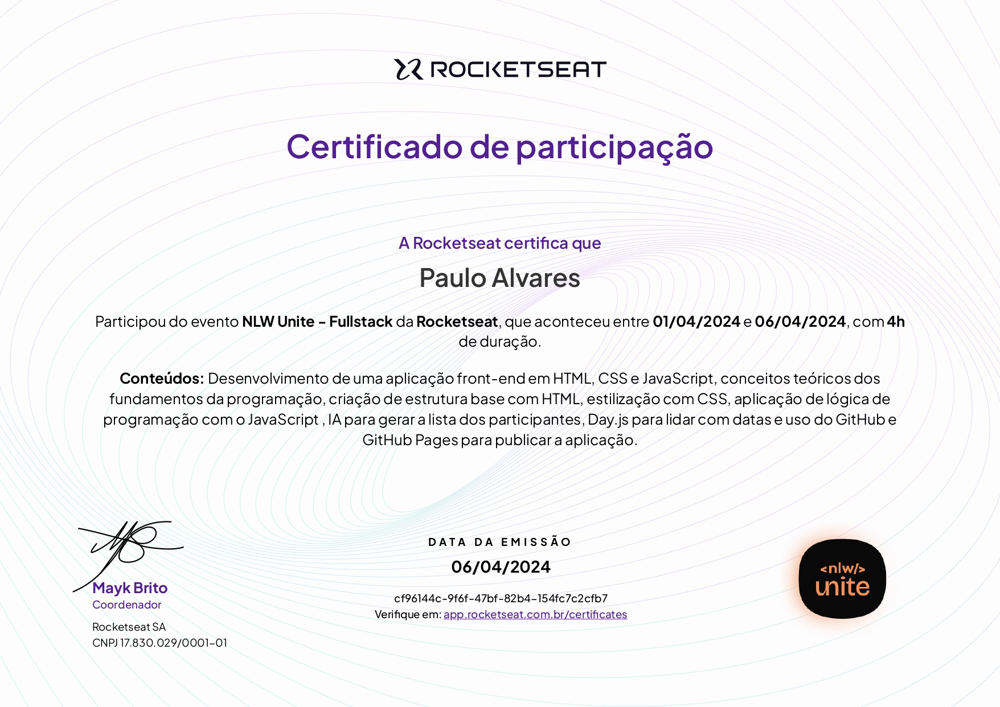

  
  <h3 align="center">NLW Unite - Full Stack - Rocketseat</h3>

# 🔍Visão Geral
  Este NLW da Rocketseat apresenta uma introdução abrangente aos conceitos de HTML e CSS aplicados ao desenvolvimento Front-End. A imersão explora boas práticas de estruturação e estilização de páginas web, ajudando a aprimorar as habilidades na criação de interfaces modernas. Além disso, a experiência é reforçada com um projeto prático, no qual é desenvolvido um sistema de cadastro de links usando JavaScript, permitindo a aplicação dos conhecimentos adquiridos de forma dinâmica e interativa.

  <h3> 💻Tecnologias Aprendidas</h3>
  

# 📚Conteúdo Abordado 
  * Abertura
  * Aula 01 - O início da sua especialização
  * Aula 02 - Acelerando o seu aprendizado
  * Aula 03 - O próximo nível
  * Encerramento

# 🏅Certificado

# 🔗Recursos Adicionais
### 🔧Ferramentas
  - <a href="https://code.visualstudio.com/download">Visual Studio Code</a>
  - <a href="https://www.fronteditor.dev/">Front-end Editor</a>

### 📖Guias de Referência
  - <a href="https://developer.mozilla.org/en-US/docs/Web/HTML">HTML</a>
  - <a href="https://developer.mozilla.org/en-US/docs/Web/CSS">CSS</a>
  - <a href="https://developer.mozilla.org/en-US/docs/Web/JavaScript">JavaScript</a>

### 📎Curso
  - <a href="https://app.rocketseat.com.br/events/nlw-unite/overview">NLW Unite</a>

# 📬Contato

 
  
  
   
  
  
  

